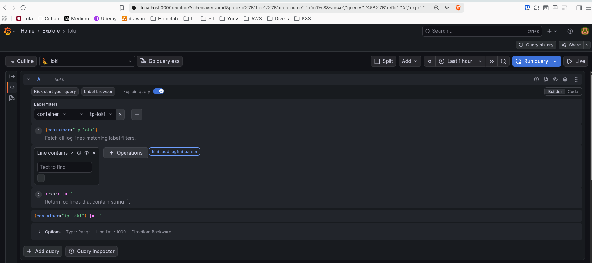
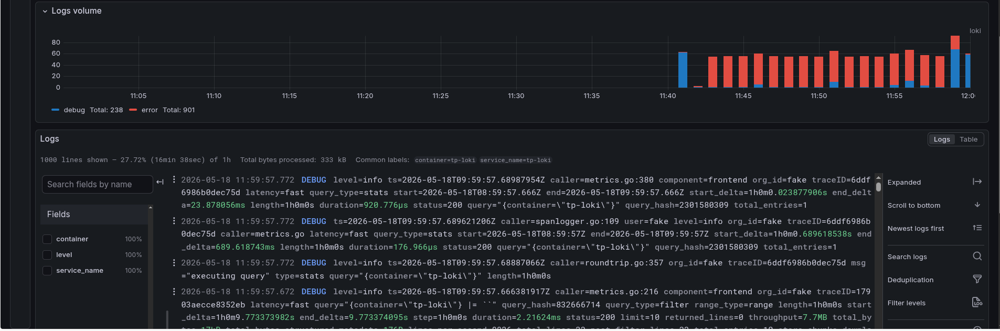
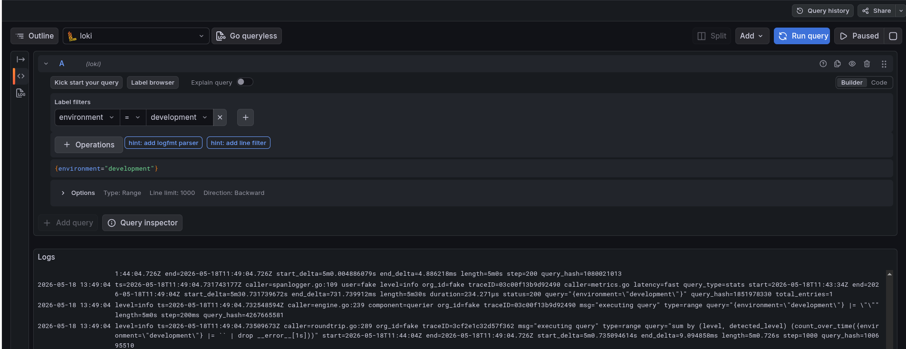
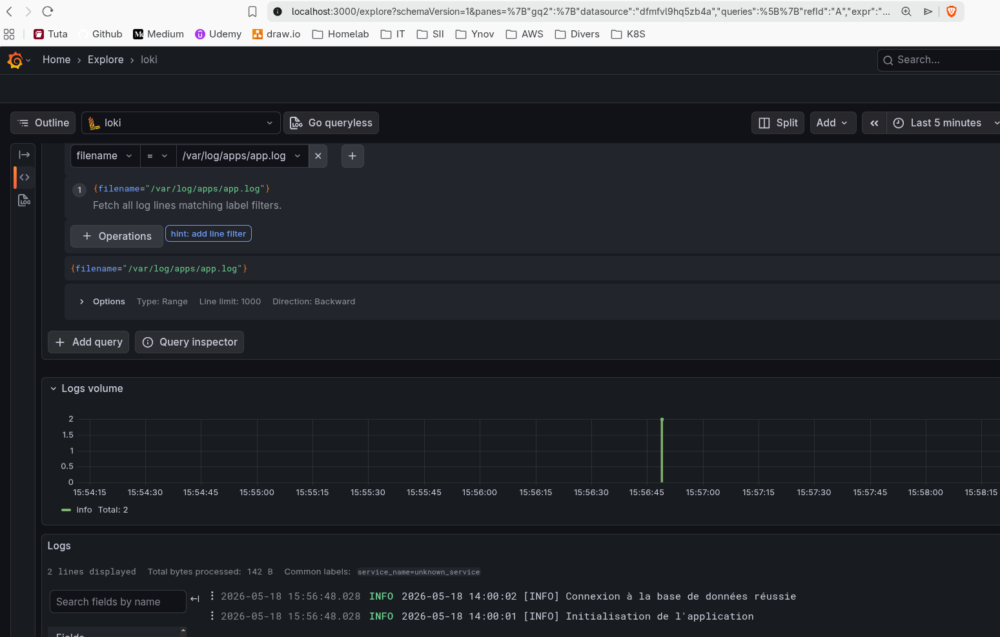
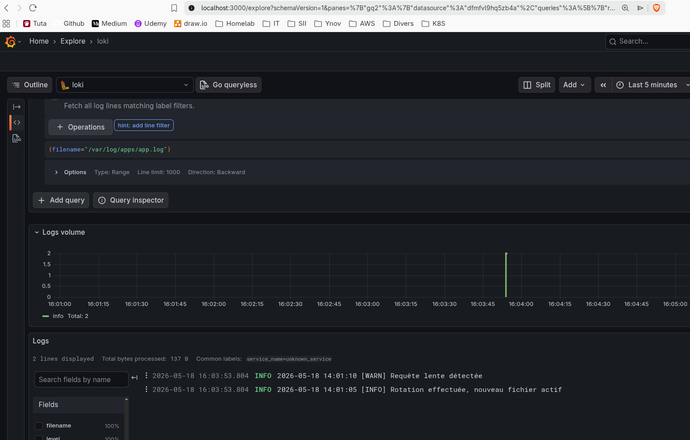

# Module 1 : Les Fondamentaux

## Exercice 1 : Déploiement mono-nœud et vérification du flux de logs
- **Objectif** : Déployer une instance fonctionnelle de Grafana, Loki, et Grafana Alloy.
- **Tâche** : Créer un fichier docker-compose.yml incluant Loki, Grafana et Alloy. Configurer Grafana Alloy pour collecter les fichiers de logs locaux ou de conteneurs et les acheminer vers Loki. Connecter Grafana à Loki et valider le flux via l'onglet Explore.

---

### Architecture du Pipeline

Le flux de données respecte la logique suivante :

- Grafana Alloy découvre les conteneurs via le socket Docker de l'hôte, applique un nettoyage de labels, puis extrait les logs
- Alloy pousse ces logs vers l'API de Loki (port 3100)
- Grafana (port 3000) requête Loki pour afficher les logs dans l'interface graphique

### Fichiers du TP
**Docker compose**
```yaml
services:
  loki:
    image: grafana/loki:3.0.0
    container_name: tp-loki
    ports:
      - "3100:3100"
    command: -config.file=/etc/loki/local-config.yaml
    networks:
      - observability

  alloy:
    image: grafana/alloy:latest
    container_name: tp-alloy
    ports:
      - "12345:12345"
    volumes:
      - ./config.alloy:/etc/alloy/config.alloy:ro
      - /var/run/docker.sock:/var/run/docker.sock:ro
    command: run --storage.path=/var/lib/alloy/data --server.http.listen-addr=0.0.0.0:12345 /etc/alloy/config.alloy
    user: root
    depends_on:
      - loki
    networks:
      - observability

  grafana:
    image: grafana/grafana:latest
    container_name: tp-grafana
    ports:
      - "3000:3000"
    environment:
      - GF_SECURITY_ADMIN_PASSWORD=admin
    depends_on:
      - loki
    networks:
      - observability

networks:
  observability:
    driver: bridge
```
&nbsp;

**Fichier config.alloy**
*Configuration modulaire de l'agent Alloy pour la découverte, le traitement des labels et l'expédition.*
```
// 1. Découverte des conteneurs Docker locaux
discovery.docker "local_containers" {
  host = "unix:///var/run/docker.sock"
}

// 2. Réécriture des labels internes (On transforme __meta_docker_container_name en "container")
discovery.relabel "clean_labels" {
  targets = discovery.docker.local_containers.targets

  rule {
    source_labels = ["__meta_docker_container_name"]
    regex         = "/(.*)" // Docker met souvent un "/" devant le nom, on l'enlève ici
    target_label  = "container"
  }
}

// 3. Collecte des logs des conteneurs avec les labels nettoyés
loki.source.docker "container_logs" {
  host       = "unix:///var/run/docker.sock"
  targets    = discovery.relabel.clean_labels.output
  forward_to = [loki.write.loki_backend.receiver]
}

// 4. Envoi des logs vers l'instance Loki
loki.write "loki_backend" {
  endpoint {
    url = "http://loki:3100/loki/api/v1/push"
  }
}
```
&nbsp;

### Déploiement et validation
#### initialisation de la stack
```yaml
docker compose up -d
```
#### Validation du fonctionnement d'Alloy
Vérification que l'agent Alloy est bien Up et que son graphe de composants est sain en visitant l'interface d'administration : http://localhost:12345/

#### Raccordement de la Data Source dans Grafana
- Connexion sur http://localhost:3000 (admin/admin)
- Navigation : Connections > Data sources > Add data source > Loki
- Configuration de l'URL interne au réseau Docker : http://loki:3100
- Clic sur Save & test pour valider la communication

#### Visualisation et requêtage (Explore)
- Aller dans l'onglet Explore de Grafana
- Sélectionner la source Loki
- Utiliser le Label Browser : sélectionner le label container, choisir une cible (ex: tp-loki), et cliquer sur Run query pour afficher le flux de logs en temps réel


&nbsp;


&nbsp;

---
## Exercice 2 : Comprendre les labels et le mécanisme de Relabeling
- **Objectif** : Assimiler la gestion des labels par Grafana Alloy et l'indexation par Loki.
- **Tâche** : Modifier la configuration Alloy pour supprimer un label natif (ex. container_id ou filename). Ajouter un label statique 'environment=development' et un label dynamique 'loglevel' extrait des métadonnées du flux de logs. Vérifier le résultat dans Grafana.
---

### Nouvelle version du fichier `config.alloy`
```
// 1. Découverte dynamique des conteneurs
discovery.docker "local_containers" {
  host = "unix:///var/run/docker.sock"
}

// 2. Relabeling des Cibles (Targets)
discovery.relabel "clean_labels" {
  targets = discovery.docker.local_containers.targets

  // Conserver le nom du conteneur
  rule {
    source_labels = ["__meta_docker_container_name"]
    regex         = "/(.*)"
    target_label  = "container"
  }

  // TÂCHE A : On expose temporairement l'ID du conteneur pour simuler un label natif encombrant
  rule {
    source_labels = ["__meta_docker_container_id"]
    target_label  = "container_id"
  }

  // TÂCHE B : Ajout d'un label statique 'environment'
  rule {
    target_label = "environment"
    replacement  = "development"
  }
}

// 3. Collecte des logs
loki.source.docker "container_logs" {
  host       = "unix:///var/run/docker.sock"
  targets    = discovery.relabel.clean_labels.output
  forward_to = [loki.relabel.drop_unwanted_labels.receiver]
}

// 4. TÂCHE A (Suite) : Suppression du label natif 'container_id' du flux de logs
loki.relabel "drop_unwanted_labels" {
  forward_to = [loki.process.extract_loglevel.receiver]

  rule {
    action = "labeldrop"
    regex  = "container_id"
  }
}

// 5. TÂCHE C : Extraction dynamique du 'loglevel' depuis le corps du log
loki.process "extract_loglevel" {
  forward_to = [loki.write.loki_backend.receiver]

  // On cherche un motif du type "level=info" ou "level=error" dans la ligne de log
  stage.regex {
    expression = "level=(?P<extracted_level>\\w+)"
  }

  // On promeut la valeur extraite en tant que vrai label Loki indexé
  stage.labels {
    values = {
      loglevel = "extracted_level",
    }
  }
}

// 6. Envoi final vers Loki
loki.write "loki_backend" {
  endpoint {
    url = "http://loki:3100/loki/api/v1/push"
  }
}
```

&nbsp;
### Déploy infra
Le docker-compose reste le même, il faut le relancer avec `docker compose up -d`



&nbsp;

---
## Exercice 3 : Rotation des logs et découverte dynamique
- **Objectif** : Garantir une collecte continue et sans doublons lors des événements de rotation de fichiers.
- **Tâche** : Configurer Alloy pour suivre un répertoire (/var/log/apps/*.log). Simuler l'activité d'une application, puis déclencher manuellement une rotation de fichiers (renommage et création d'un nouveau fichier vide). Confirmer qu'Alloy conserve sa position de lecture sans perte.


### Protocole de Simulation de Rotation (Script de Test)

Pour valider le comportement de l'agent, le scénario suivant a été exécuté manuellement :

```bash
# Step 1 : Création du fichier et injection des logs initiaux
echo "2026-05-18 14:00:01 [INFO] Initialisation de l'application" >> apps_logs/app.log
echo "2026-05-18 14:00:02 [INFO] Connexion DB réussie" >> apps_logs/app.log

# Step 2 : Déclenchement de la rotation (Simule logrotate)
mv apps_logs/app.log apps_logs/app.log.1
touch apps_logs/app.log

# Step 3 : Nouvelles écritures post-rotation
echo "2026-05-18 14:01:05 [INFO] Rotation effectuée, nouveau fichier actif" >> apps_logs/app.log
echo "2026-05-18 14:01:10 [WARN] Requête lente détectée" >> apps_logs/app.log

# Step 4 : Écriture résiduelle dans l'ancien descripteur
echo "2026-05-18 14:01:15 [INFO] Log de fermeture de l'ancien descripteur" >> apps_logs/app.log.1
```

### Observations et résultats dans Grafana

En exécutant la requête LogQL `{filename=~"/var/log/apps/.*"}` dans l'onglet Explore, les résultats suivants confirment :
- Absence de doublons : les logs initiaux (14:00:01 et 14:00:02) n'apparaissent qu'une seule fois. Bien que le fichier ait été renommé en app.log.1, Alloy n'a pas repris la lecture au début de ce fichier archivé.
- Absence de perte : les logs du nouveau fichier app.log (14:01:05) ont été capturés immédiatement dès sa création.
- Prise en compte des écritures tardives : le log injecté dans app.log.1 après le renommage a bien été indexé par Loki.





---

## Exercice 4 : Pipelines Alloy et Parsing à la source
- **Objectif** : Transformer, filtrer et enrichir les structures de logs directement au niveau de la couche de collecte.
- **Tâche** : Produire des logs fictifs au format JSON. Configurer un composant 'loki.process' dans Grafana Alloy pour parser ce JSON, extraire le champ 'user_id' en tant que label temporaire, et supprimer toutes les lignes de niveau 'debug' avant l'envoi à Loki.
